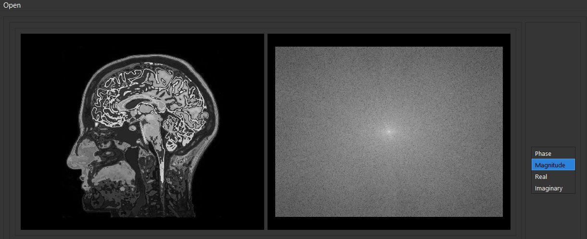

# MRI Principles representation

## **Team Members**

| Name | GitHub_UserName |
| ----------- | ----------- |
| Sarah Adel | SaraAdel540 |
| Remon Albear | remonalbear |
| Rawan Elsayed | rawansayed |
| Mohammed Almotasem | Almotasem100 |

---

## **Part One**

### Task Statment
**- Create a function that rotates the bulk magnetization vector.** <br/>
**- Plot the bulk magnetization's trajectory and generate a figure representing the results.** <br/>
## Summary about our implementation 
**We used the Bloch equations as instructed to implemnet the function that could simulate the behaviour of the magnetization vector. In our simulation the magnetization vector is represented in a red line and it's compomnent in the XY-plane is in yellow line.** <br/>
**When an RF pulse is given, Our vector rotates to the XY-plane by the given rotating angle while maintaining it's precission, when the pulse is removed the vector is tends to return to it's original directon, So it takes the Helix-path represented by the gray spiral, making the magnetization z component increases by a rate equal to: ``` Mz = Mo(1-exp(-time/T1))```** <br/>
**While that Our XY component ddecays in magnitude by a rate equal to: ``` Mxy = Mo * exp(-time/T2)```** <br/>
## Bulk Magnetization's Trajectory
### Using OpenGl
**We used openGl library which we learn it in computer graphics course this semester to simulate the bloch equations.** <br/>
**To run the code you have to  write this command in terminal in the part 1 directory.** <br/>
``` ./simulation angle T1 T2 ```

**but you have to replace angle,T1 and T2  parameters by any valid values,then the window will appear and you can see the simultion,and to repeat the Excitation/Relaxation proccess just press on (__a__) button in the keyboard this will give RF pulse with the same angle.** 

### For extra check you have to install openGL library

**[Install OpenGl](https://download.cnet.com/Apple-OpenGL/3000-2070_4-395.html)**

**After installing openGl to run the code you have to run ```simulation.c``` file in part1 folder by writing this command in terminal** <br/>
``` gcc -o simulation simulation.c -lGL -lGLU -lglut -lm ```

**this command will build file named _simulation_  ,then, run this file.** 
## We attached some GIFs for our simulation to make it easy and clear to see our output. 

**Case 1 Parameters:** <br/>
* Angle=90.
* T1=500.
* T2=200. <br/>
 <br/>
 <br/>
 <br/>
**Case 2 Parameters:** <br/>
* Angle=90.
* T1=1000.
* T2=500. <br/>
 <br/>
 <br/>
 <br/>
**Case 3 Parameters:** <br/>
* Angle=75.
* T1=500.
* T2=200. <br/>
 <br/>
 <br/>
 <br/>
---
### Using Python
**Using matplot library ,and to see this output you have to run  ```simulation.py``` file in part 1 folder.** <br/>
**The magnetization vector is represented solid black line and it's compomnent in the XY-plane is in dashed black line.** <br/>

**Parameters:** <br/>
* Angle=90.
* T1=200. <br/>
* T2=100. <br/>
 <br/>
---
---
## **Part Two** 
### Task Statment
**- Load images; show the figures. Calculate the Fourier transform of the images and plot it in the K-space domain.** <br/>
**- Define a function that simulates the non-uniformity effect; where its effect is imposed in the axial (z), but no radial (x or y)  dependence on the magnetic field strength. Make a plot of Bz(z).** <br/>
## Summary about our implementation 
**In this part we use pyqt5 libarary to make our GUI**
**[Install PyQt5](https://pypi.org/project/PyQt5/)**  <br/>
**To run our GUI you have to run ```main.py``` file in part 2 folder.** <br/>
**We used the fourier functions supported by the Scipy library to seperate the components of a given picture and display any one of them according to the choice of the user.** <br/>
**We used QT-Designer to create our GUI.** <br/>
 <br/>
**Then we implement Functions of:** <br/>
***1-Uploading image*** <br/>
 <br/>
***2-Getting Fourier Transform*** <br/>
 <br/>
***3-Graph the non-uniformity effect of Magnetic Field 1.5 Tesla*** <br/>
 <br/>
## Our GUI
 <br/>
**Step 1: Uploading Image** <br/>
 <br/>
**Step 2: you can get FT-(Magnitude/Phase/Real/Imaginary) from Combobox next to Image** <br/>
 <br/>
 <br/>
 <br/>
 <br/>
**Graph1 Button for Showing Non-Uniformity of Magnetic Field 1.5 Tesla** <br/>
 <br/>
</br>
</br>
</br>
## **Non-uniform k-space and Net Vector representation** 
**Part 1**: K-space already implemented in the previous task <br/>
**Part 2**: After adding the Non-uniformity effect to the static Magnetic field that was already calculated. <br/>
First,we create some figures to show the effect of the non-uniform magnetic field

 <br/>
 <br/>
 <br/>
Second,in our simulation with openGl we add three different vectors(red,blue,green) each rotate with diffrent freq,and the net magnetization vector in x-y plane represented by yellow color   


Also,in the simulation using python we did the same thing adding three vectors with different freq and the net magnetization vector in x-y plane represented by dashed vector

